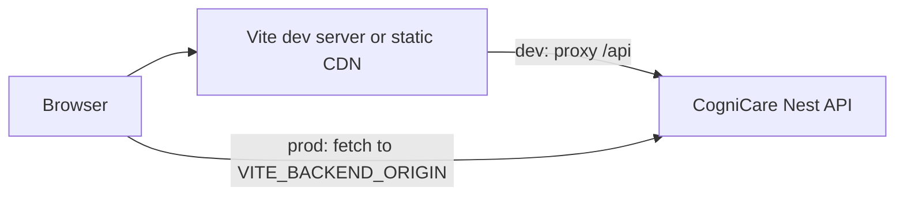

# Architecture — CogniCare Web (dashboard SPA)

**Repository:** `cognicareweb/` only. This is a **single-page application**; it does **not** host the REST API or database. The backend is **`cognicare/backend`** (deployed separately).

---

## Executive summary

**CogniCare Web** is a **React 19 + Vite 7** dashboard for **admins**, **organization leaders**, and **specialists**. It authenticates against the shared CogniCare API, stores JWTs in **localStorage** (per role), and uses **lazy-loaded** routes for each workspace.

---

## Product purpose

Operational and clinical tooling in the browser: user/org/family administration, fraud and org-scan review, training course approval, caregiver applications, org staff/family/child management, imports, specialist plan builders (PECS, TEACCH, activities, skill tracker), Progress AI and behavior analytics views.

---

## Main user roles (UI)

| Role key in `useAuth` | Login route | Layout / shell |
|----------------------|-------------|----------------|
| `admin` | `/admin/login` | `AdminLayout` → nested `/admin/dashboard/*` |
| `orgLeader` | `/org/login` | `OrgLayout` → `/org/dashboard/*` |
| `specialist` | `/specialist/login` | `SpecialistLayout` + full-page tools under `/specialist/*` |

Source: `src/App.jsx`, `src/hooks/useAuth.js`.

---

## Functional scope

Implemented as React pages under `src/pages/` — see `FEATURE_INVENTORY.md`. Public marketing **`/`** (`LandingPage`) and **`/confirm-account`**. Legacy redirects: `/healthcare` → specialist dashboard (`App.jsx`).

---

## High-level architecture

---

## Frontend architecture

- **Entry:** `src/main.jsx` → `App.jsx`.
- **Routing:** `react-router-dom` v7; **lazy** `React.lazy` per page (`App.jsx`).
- **Styling:** Tailwind CSS v4 (`@tailwindcss/vite`).
- **i18n:** `i18next` + `react-i18next` (`src/i18n.js`); RTL for `ar` toggled in `App.jsx`.
- **3D / charts:** Three.js (`@react-three/fiber`), Recharts — **used on select pages** (**needs verification** which).
- **Data:** No Redux; React state + `useAuth` helpers (`authGet`, `authMutate`, `authFetch`).

---

## Backend architecture (out of repo)

**Not applicable** in this repository. All persistence and business rules live in **`cognicare/backend`**. This SPA is a **thin client**.

---

## Database

**None in this repo.** All models are on the API side (MongoDB/Mongoose).

---

## Authentication / authorization

- **Login:** `POST {API_BASE_URL}/auth/login` with JSON body (`AdminLogin.jsx`, `OrgLeaderLogin.jsx`, `SpecialistLogin.jsx`).
- **Tokens:** `localStorage` keys `adminToken` / `orgLeaderToken` / `specialistToken` (+ refresh + user JSON) — `useAuth.js`.
- **Refresh:** `POST /auth/refresh` on 401 path inside `authFetch`.
- **Authorization:** Enforced by **API** (JWT + roles). UI hides routes via layout checks (**inferred**); deep links still require valid API role.

---

## API structure (consumer view)

Paths are relative to `API_BASE_URL` (`/api/v1` in dev). Full consumer map: **`API_MAP.md`**.

---

## State management

Component-local `useState` / `useEffect`; shared theme via `context/ThemeContext.jsx`; auth via `useAuth` hook instances per layout.

---

## Third-party (frontend)

- **i18next**, **Three.js**, **Recharts**, **xlsx** (`package.json`).
- **Google Fonts** via CSP in `vite.config.js`.

---

## File organization

- `src/pages/admin|org|specialist|shared|home` — feature pages.
- `src/components/` — layout and UI primitives.
- `src/hooks/` — `useAuth`, `useTheme`.
- `architecture/` — existing concise docs + QA bilans.

---

## Deployment / runtime

- **Dev:** `npm run dev` → default **http://localhost:5173**; API proxied per `vite.config.js` (`VITE_BACKEND_ORIGIN` or `http://localhost:3000`).
- **Prod:** `npm run build` → static assets; host must set **`VITE_BACKEND_ORIGIN`** to live API; CORS must allow web origin (`cognicare/backend` `main.ts`).

---

## Security

- Vite dev **CSP** headers in `vite.config.js` (`connect-src` includes `backendOrigin`).
- **JWT in localStorage** — XSS risk; mitigate with CSP, dependency hygiene, no `dangerouslySetInnerHTML` without audit.
- Credentials: `authFetch` uses Bearer header (**needs verification** if `credentials: 'include'` required for cookies — currently token-based).

---

## Performance

- **Lazy routes** → code splitting.
- **`authGet` cache** in `useAuth.js` (TTL ~60s) and **`cachedGet`** in `apiClient.js` for optional use.
- **manualChunks** in Vite for react and i18n vendors.

---

## Technical debt / risks

- `*_OLD.jsx` files may confuse contributors.
- No automated E2E in `package.json`.
- Dev **must** align backend port with `VITE_BACKEND_ORIGIN` (documented in `architecture/API-AND-ENV.md`).

---

## Future scalability

- Add **Playwright** CI smoke per role.
- Consider **React Query** for cache invalidation instead of ad hoc GET caches.
- Environment-specific config modules for staging vs prod.
