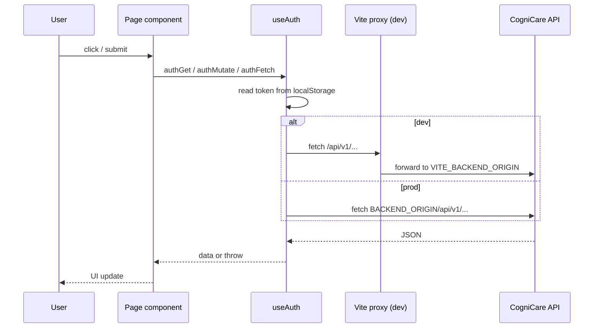

# Data flow — `cognicareweb/`

## User input → React → API

## Login / refresh

1. User submits credentials → `fetch(API_BASE_URL + '/auth/login')`.
2. Store `accessToken`, `refreshToken`, user JSON in **role-specific** keys (`useAuth.js`).
3. On **401**, `authFetch` calls `POST /auth/refresh`, updates tokens, retries once.

## Uploads / images

`getUploadUrl()` in `config.js` prefixes relative paths with `BACKEND_ORIGIN` in production so `` loads from API host.

## No local database

All reads/writes persist only after API calls succeed.

## Caching

- `authGet` uses in-memory Map + TTL (`useAuth.js`).
- `cachedGet` in `apiClient.js` — used by **legacy** `*_OLD` pages **inferred**; current pages prefer `authGet`.

## External services

This SPA does not call PayPal/Cloudinary directly for server operations — those are API-side. Browser may open PayPal in flows initiated from **Flutter**; web admin flows **needs verification**.
